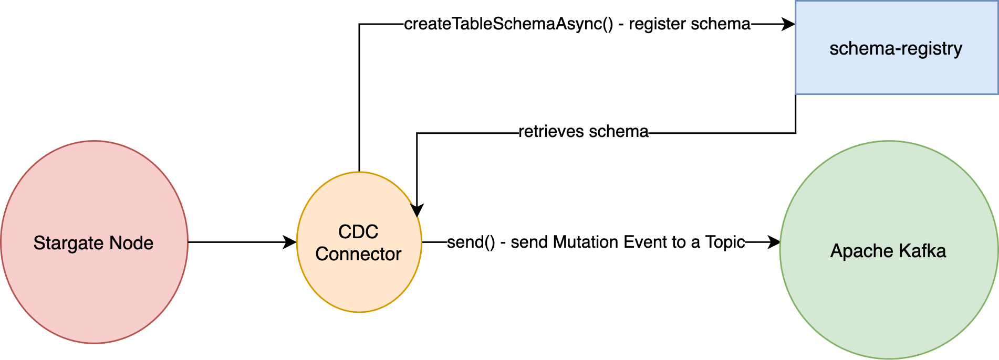

= Using the Kafka CDC Producer

This extension provides support for sending Change Data Capture(CDC) events to an Apache Kafka®.
It is designed to work with the Stargate.

== Kafka CDC - Stargate integration

This extension is designed to integrate with Stargate. It uses a link:https://www.osgi.org/[OSGi] framework for registering the extension within Stargate.
The `KafkaProducerActivator` class handles the registration process. When you put the `producer-kafka-{version}.jar` in the
`/stargate-lib` directory it will be automatically picked, and the activator logic is invoked.

This extension has one service required: `Metrics` - this is provided by the `CoreActivator` in the link:../core[core] module.

== Architecture

The main entry point for this CDC connector is a link:../producer-kafka/src/main/java/io/stargate/producer/kafka/KafkaCDCProducer.java[KafkaCDCProducer].
It extends the `SchemaAwareCDCProducer` interface that serves as an integration layer between Stargate's persistence and CDC extension.

1. `init()` - takes the map of configuration settings that are passed from Stargate to the CDC connector. The configuration settings are described in <<Configuration>>

2. `createTableSchemaAsync()` - MUST be invoked on every Stargate node before any call to `send` is made (including restarts).
This method is responsible for constructing the Avro schema based on the `TableMetadata` and registering the schema in link:https://docs.confluent.io/current/schema-registry/index.html[schema registry].
It is also invoked if any schema change on a CDC-enabled table is made. The detailed process of schema creation is described in <<Schema Creation>>

3. `send()` - it is responsible to create a link:https://avro.apache.org/docs/1.10.0/api/java/org/apache/avro/generic/GenericRecord.html[GenericRecord] based on the Avro schema created in the previous step.
Once the record is created, it is sent to the Apache Kafka topic.

4. `close()` - it flushes all pending records from the underlying Kafka producer and closes it.

Let's recap the basics of architecture. The CDC connector is working within a Stargate node. The stargate node sends the TableMetadata when the schema is changed, OR the Stargate node is restarted.
It constructs the schema and registers it in the schema registry. When the new CDC event occurs, Stargate propagates
this change to the CDC extension via the send() method. The send() method retrieves the schema from the schema registry (or a local cache), constructs the Avro record, and then sends it to Kafka.

== Configuration

The `init()` method takes the `Map<String, Object>` as an argument. This map must contain the required settings for running the Kafka CDC connector.
There are multiple required settings:

=== Prefix Name

`cdc.kafka.topic.prefix-name` - it should contain a `String` value. It is used to construct the topic name to which the CDC modification for a given TableMetadata is sent.
Value from this setting is used as a prefix. For example, if the prefix is 'p', keyspace 'ks' and table 't', the final topic name will be: 'p.ks.t'
The send() will publish a CDC event to a Kafka topic constructed using this strategy

=== Kafka Producer Settings
All Kafka Producer settings must be prefixed with `cdc.kafka.producer`.
The Kafka producer has an extensive list of producer settings. For a full list, please visit the link:https://kafka.apache.org/documentation/#producerconfigs[Kafka producer configs].
All settings with the `cdc.kafka.producer` passed to this extension will be passed to the Kafka producer.
So for example, the `cdc.kafka.producer.max.block.ms` will be trimmed to `max.block.ms` and passed to the producer.
There are two required settings that you need to pass to the CDC connector.

- `cdc.kafka.producer.bootstrap.servers` - please note that you need to prefix it with CDC setting prefix. It contains a list of Kafka servers.
- `cdc.kafka.producer.schema.registry.url` - contains one URL or multiple urls for a schema registry that will be used to schema management.
The `schema-registry` should work in the `full_transitive` compatibility mode to allow the backward and forward compatible evolution of schema.
To see how to achieve it, please visit the link:https://docs.confluent.io/current/schema-registry/avro.html#compatibility-types[Schema Registry Guide].
- There are two Kafka producer settings which cannot be set by the user: `key.serializer` and `value.serializer` - both must be set to `KafkaAvroSerializer.class`
because the CDC producer uses Avro format for publishing events to Kafka. Any value provided for these two settings will be ignored.

=== Metrics Settings
The metrics framework has three settings that allow you to control it:

- `cdc.kafka.metrics.enabled` - whether the CDC extension should register all Kafka producer metrics in the `MetricRegistry`. This setting is required. It should contain a boolean value.
- `cdc.kafka.metrics.include-tags` - whether the registered metric name should include tags(if exists). This setting is optional. If not specified, it will be set to `true`. It should contain a boolean value.
- `cdc.kafka.metrics.name` - this is the prefix used to expose metrics on the `MetricRegistry`. This setting is optional. If not specified, it will be set to `producer`.
The CDC connector also adds its own prefix to every metric: `cdc.kafka`. If you leave this setting unset, every metric will be prefixed with `cdc.kafka.producer.`

== Schema Creation
When the `createTableSchemaAsync()` is invoked on the CDC producer, it constructs the Avro `Schema` for key and value.
Let's take a look at the process of constructing a Avro schema.

=== Key Schema
The key schema contains all partition keys from the TableMetadata passed to the `createTableSchemaAsync`.
For example, if the table metadata contains one primary key with a field name: `pk_1` of a string type, the constructed schema will be:
[source,json]
----
{
   "type":"record",
   "name":"Key",
   "namespace":"topicPrefix.keyspaceName.tableName",
   "fields":[
      {
         "name":"pk_1",
         "type":"string"
      }
   ]
}
----
Please note that this schema's name will be `Key`, but this schema is created in the context of a specific namespace.
The namespace equals a topic name constructed based on the `cdc.kafka.topic.prefix-name` and `TableMetadata` keyspace and table.
Once the schema for a specific key is created, you cannot remove or rename any existing field. Such a change will not be backward compatible.
By doing so, you will break the consumers of the Kafka topic. You are allowed to add a new Primary Key because adding a new field to an Avro schema is backward compatible.

=== Value Schema
The value schema is more complicated because it must allow three states for any Non-Primary Key field.
A given column of a row can have a new value during a database mutation, it can be cleared (set to null) or left unchanged.
In the same way, for a given field, the Value schema can contain the new value, the null value, or the absence of the value.
Let's take a look at a simple value schema with three fields: the primary key of a string type, the clustering key that is an int, and the normal column value that is a string:
[source,json]
----
{
   "type":"record",
   "name":"Value",
   "namespace":"topicPrefix.keyspaceName.tableName",
   "fields":[
      {
         "name":"op",
         "type":"string"
      },
      {
         "name":"ts_ms",
         "type":"long"
      },
      {
         "name":"data",
         "type":{
            "type":"record",
            "name":"Data",
            "fields":[
               {
                  "name":"pk_1",
                  "type":[
                     "null",
                     {
                        "type":"record",
                        "name":"pk_1",
                        "namespace":"",
                        "fields":[
                           {
                              "name":"value",
                              "type":"string"
                           }
                        ]
                     }
                  ],
                  "default":null
               },
               {
                  "name":"ck_1",
                  "type":[
                     "null",
                     {
                        "type":"record",
                        "name":"ck_1",
                        "namespace":"",
                        "fields":[
                           {
                              "name":"value",
                              "type":"int"
                           }
                        ]
                     }
                  ],
                  "default":null
               },
               {
                  "name":"col_1",
                  "type":[
                     "null",
                     {
                        "type":"record",
                        "name":"col_1",
                        "namespace":"",
                        "fields":[
                           {
                              "name":"value",
                              "type":[
                                 "null",
                                 "string"
                              ],
                              "default":null
                           }
                        ]
                     }
                  ],
                  "default":null
               }
            ]
         }
      }
   ]
}
----
The name of this schema is `Value` and it is created in the same namespace as `key` schema.
There are two required fields. The first one is `op` denoting the type of operation. It can be updated, meaning that some value in the CDC enabled table changed.
For the update, the `op` will have a value equal to `u`. The second possible state is deleted which means that there was a delete on the field in the database.
The deleted value is `d`. The `ts_ms` contains the timestamp of a change.
Every field (Primary Key, Clustering Key, and normal cell) has a union schema, meaning the whole field can be absent.
The field's actual value is also a union of the type of a field and `null`. When the value is `null`, it means that the field was cleared.
So, to sum up, such a structure allow the CDC connector to model 3 states:

==== Absence of the Value
The absence of change is presented as a null union value. For example, if `col_1` was not modified then the Avro record will look like this:

[source,json]
----
{
   "op":"u",
   "ts_ms":0,
   "data":{
      "pk_1":{
         "value":"pk_value"
      },
      "ck_1":{
         "value":1
      },
      "col_1":null
   }
}
----
Please note that the `col_1` has a null entry denoting no change to a given field.

==== Clearing the value
If the `col_1` was cleared, meaning that it was deleted or set to null, the resulting record would look like this:
[source,json]
----
{
   "op":"u",
   "ts_ms":0,
   "data":{
      "pk_1":{
         "value":"pk_value"
      },
      "ck_1":{
         "value":1
      },
      "col_1":{
        "value": null
      }
   }
}
----
Please note that the `col_1` contains the `value`, but the actual value is equal to `null`.

==== Change of the value

Finally, the most obvious state is denoting that there was a change to the particular field.
The resulting CDC event will contain the value with a change:
[source,json]
----
{
   "op":"u",
   "ts_ms":0,
   "data":{
      "pk_1":{
         "value":"pk_value"
      },
      "ck_1":{
         "value":1
      },
      "col_1":{
         "value": "new_value"
      }
   }
}
----
The `new_value` means a change of the `col_1` cell in the underlying database.

The value schema is more flexible regarding keeping the compatibility.
This flexibility is achieved by using a union type that allows the evolution of schema in a backward-compatible way.
It will enable renaming, adding, and removing of Clustering Key and Cells.
To make it work, you need to assure that the consumer will read the Avro record using proper schema id.

=== Schema Supported Types
The resulting schema supports a variety of types that can be used for any cell value.

==== Supported Native Types.
Let's take a look at a list of supported native types:

- `Native.ASCII` is serialized as avro `Type.STRING`.
- `Native.BIGINT` is serialized as avro `Type.LONG`.
- `Native.BLOB` is serialized as avro `Type.BYTES`.
- `Native.BOOLEAN` is serialized as avro `Type.BOOLEAN`.
- `Native.COUNTER` is serialized as avro `Type.LONG`.
- `Native.DATE` is serialized as avro logical `date` type with underlying `Type.INT` representation.
- `Native.DECIMAL` is serialized as avro logical `decimal` type with underlying `Type.BYTES` representation. It uses `10` as a default decimal precision.
- `Native.DOUBLE` is serialized as avro `Type.DOUBLE`.
- `Native.DURATION` is serialized as a raw `Type.BYTES`
- `Native.FLOAT` is serialized as avro `Type.FLOAT`.
- `Native.INET` is serialized as a raw `Type.BYTES`
- `Native.INT` is serialized as avro `Type.INT`.
- `Native.SMALLINT` is serialized as avro logical `short` type with underlying `Type.INT` representation.
- `Native.TEXT` is serialized as avro `Type.STRING`.
- `Native.TIME` is serialized as avro logical `timeMicros` type with underlying `Type.LONG` representation.
- `Native.TIMESTAMP` is serialized as avro logical `timestampMillis` type with underlying `Type.LONG` representation.
- `Native.TIMEUUID` is serialized as avro logical `uuid` type with underlying `Type.STRING` representation.
- `Native.TINYINT` is serialized as avro logical `byte` type with underlying `Type.INT` representation.
- `Native.UUID` is serialized as avro logical `uuid` type with underlying `Type.STRING` representation.
- `Native.VARCHAR` is serialized as avro `Type.STRING`.
- `Native.VARINT` is serialized as avro logical `bigInteger` type with underlying `Type.BYTES` representation.

==== Map Type
Avro assumes that every key is of a string type and automatically converts every key to a
string representation. See link:http://avro.apache.org/docs/1.10.0/api/java/org/apache/avro/util/Utf8.html[Utf8] - all keys are converted to this class.
For example, a map with Integer values will have such Avro schema:
[source,json]
----
{
  "type":"map",
  "values":{
    "type":"map",
    "values":"int"
  }
}
----
Please note that there is no field that represents the value for keys in a map.

==== List and Set Types
Both lists and sets are converted to the Avro array type.
For example, the resulting type for set and list of an integer type will be:
[source,json]
----
{
 "type":"array",
 "items":"int"
}
----

==== User Defined Type (UDT) Schema
The UserDefined is a Record type in Avro.
For example, such an UserDefined type:

[source,java]
----
LinkedHashMap<String, CQLType> udtColumns = new LinkedHashMap<>();
udtColumns.put("udtcol_1", Native.INT);
udtColumns.put("udtcol_2", Native.TEXT);
UserDefined userDefinedType = new UserDefined("ks", "typeName", udtColumns);
----

will have the following schema:

[source,json]
----
{
"type":"record",
"name":"typeName",
"fields":[
   {
      "name":"udtcol_1",
      "type":"int"
   },
   {
      "name":"udtcol_2",
      "type":"string"
   }
 ]
}
----

The generated schema also supports nested UserDefined types.

==== Tuple Type

The Tuple is a Record type in Avro. For example, such a Tuple type:

[source,java]
----
new Tuple(Native.INT, new Collection(Kind.LIST, Native.TEXT));
----

will have the following schema:

[source,json]
----
{
"type":"record",
"name":"tuple_int_list_text__",
"fields":[
   {
      "name":"t_0",
      "type":"int"
   },
   {
      "name":"t_1",
      "type":{
         "type":"array",
         "items":"string"
      }
   }
 ]
}
----

Please note that the name of the record is transformed according to `CqlToAvroTypeConverter#tupleToRecordName(Tuple)` method.
Every element in the tuple has a name according to `CqlToAvroTypeConverter#toTupleFieldName(int)`.
The generated schema also supports nested Tuple types.

==== Custom Type
The custom type is saved as bytes without an attempt to deserialize it. It's the client
responsibility to deserialize it correctly.
Currently, the class name form `Custom#getClassName()` is not propagated in the avro message.

== New Topic Creation
When a mutation event for a topic that does not exist in Kafka arrives, the producer will create the topic automatically if
link:https://kafka.apache.org/documentation/#allow.auto.create.topics[allow.auto.create.topics] on the Kafka broker is enabled.
It is enabled by default. **NOTE**: you should be careful with this setting since Kafka will automatically create the topic with the default replication factor and number of partitions.
You should check if the link:https://kafka.apache.org/documentation/#num.partitions[default number of partitions]
and link:https://kafka.apache.org/documentation/#default.replication.factor[replicas] settings are optimal for your cluster.
Otherwise, you may end up with a topic that does not have enough replicas which may degrade the performance of the CDC producer substantially.

You may consider disabling the `allow.auto.create.topics`, but in that case, you will need to create every topic manually according to <<Prefix Name>>.
It also means that you need to create the topic manually before any CDC event is sent to this producer.
